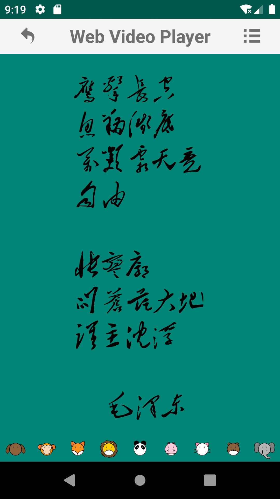
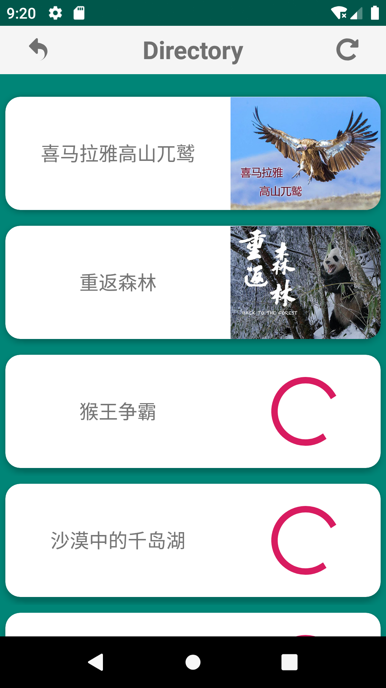
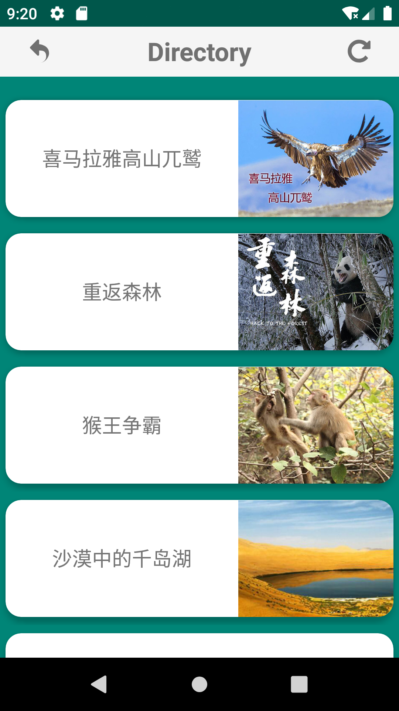
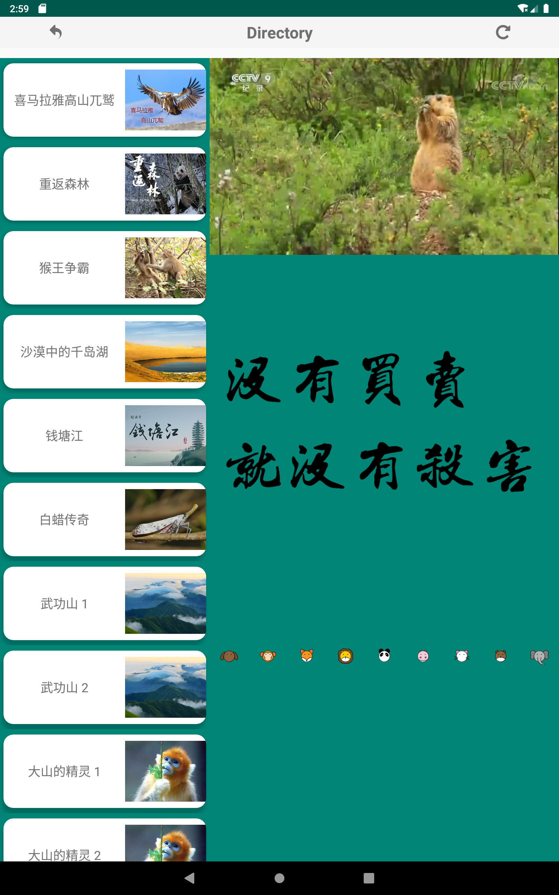
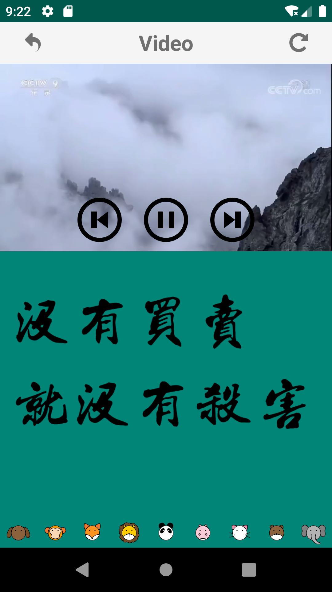
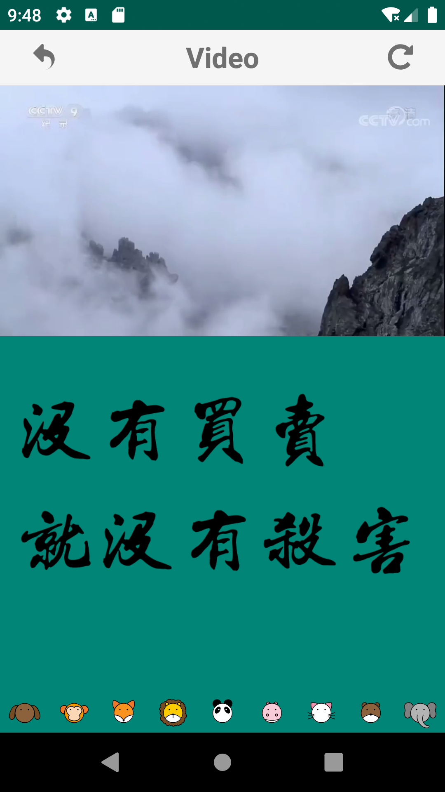
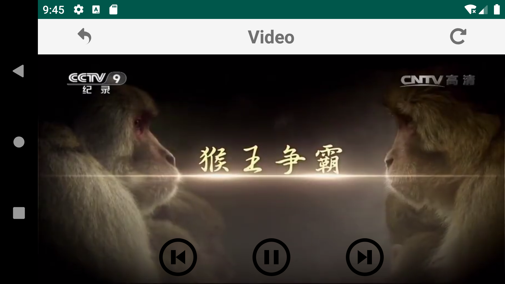

# Web Video Player

## 简介

一个播放在线视频的 Android Application

- 视频来源：”[学习强国](https://www.xuexi.cn/)“ APP

- 主题：人与自然

## 实现

- Fragement
- Adapter
- SQLiteDatabase
- CardView
- ImageButton
- VideoView

## 展示

- 着陆页

可退出或进入视频列表页。

- 列表页（Phone）

加载网络图片作为封面，可手动刷新；点击列表子项进入播放页面。

- 列表页（Pad）

左侧视频列表，右侧播放页面。

- 播放页（vertical）

轻触屏幕按键可见7s，期间再次轻触，按键不可见；可暂停、继续播放、播放下一个、播放上一个。

- 播放页（horizontal）

横屏时视频自动全屏，其余同上。

